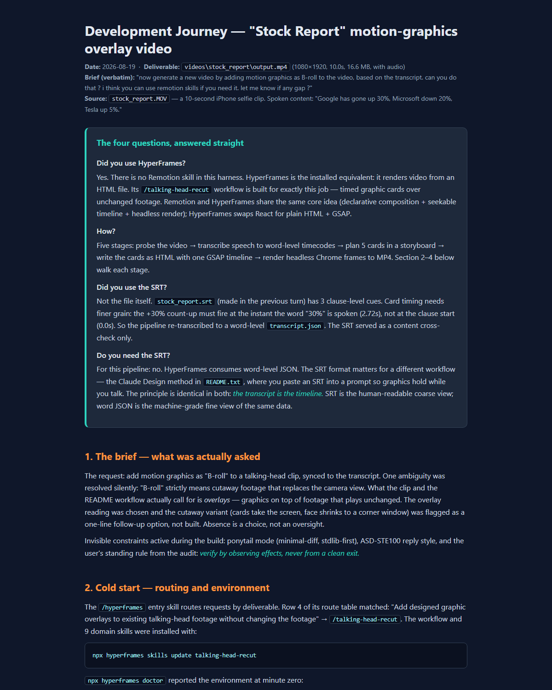

# claude-synced-motion-graphics

One 10-second selfie stock report, transformed twice by AI agents — autonomously.

Inspiration: [Claude FINALLY Turned Into a Design Genius (Motion Graphics, Websites & More)](https://www.youtube.com/watch?v=gEPfF6BFAB4&t=576s).

*Click the preview to read the full development journey as a live page.*

## Half 1 — transcript-synced motion graphics

A talking-head clip gets five designed overlay cards (title badge, three stock
count-up callouts, a closing summary strip), each timed to the exact word being
spoken. Pipeline: faster-whisper word-level transcript → storyboard → one HTML
composition with a seekable GSAP timeline → HyperFrames headless-Chrome render.
Cost: $0 — everything ran locally.

## Half 2 — face swap and voice change

The speaker is replaced by a fictional retired professor (AI-generated face —
no real person's likeness), using `fal-ai/wan/v2.2-14b/animate/replace`, which
keeps the original motion and lip sync. The voice is then converted with
ElevenLabs speech-to-speech (`eleven_multilingual_sts_v2`), which keeps the
exact word timing so the lips stay in sync. Total cost: ≈ $1.56.

**Final deliverable:** `videos/stock_report/output_professor_voiced.mp4` —
new face, new voice, original overlays.

## Read the full story

- `dev-journey-stock-report.html` — the warts-and-all development journey of
  both halves: decisions, models, costs, failures, verification, and the
  unknown unknowns of AI video/audio editing.
- `faceswap-plan.html` — the researched plan of record, written and approved
  before a single paid API call.
- `HANDOFF.md` — resume state for future agent sessions.

## Privacy

The original recording (face and voice) is deliberately not in this repository.
Only artifacts produced after the face swap and voice change are committed;
`.gitignore` enforces the boundary.
